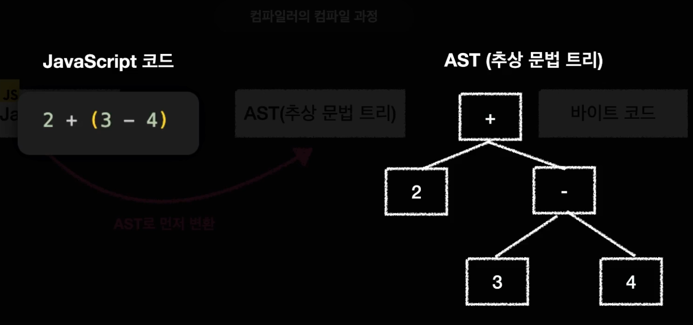
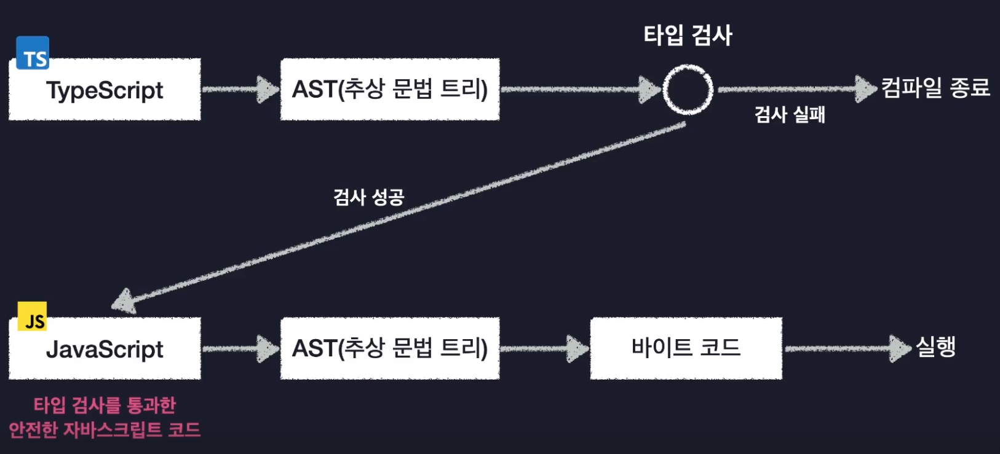
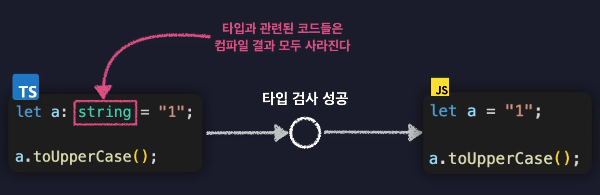

# TS 1강

Status: Done
Due date: 06/06/2025
Task type: 👀 강의
세부사항: 동작원리, 자바스크립트 한계점, 컴파일러 옵션 설정
Updated at: 2025년 6월 7일 오후 11:24

## 상세설명

Type Script 공부를 통해서 자바스크립트의 한계점을 극복할 수 있다.

## 세부적으로 할 일

- [x] Section 01 - 한계점, 동작원리, 컴파일러 옵션 설정
- [x] review

## 참고자료

[https://www.inflearn.com/courses/lecture?courseId=330452&type=LECTURE&unitId=147956&subtitleLanguage=ko](https://www.inflearn.com/courses/lecture?courseId=330452&type=LECTURE&unitId=147956&subtitleLanguage=ko)

review ⇒

개요

자바스크립트에는 정확히 어떤 한계점이 있는가

타입시스템

모든 프로그래밍 언어는 타입 시스템이라는 것이 존재한다.

문법

타입시스템의 두 갈래

정적타입 시스템과 (코드 실행 이전, 모든 변수의 타입을 고정적으로 결정) ⇒ 엄격하고 고정적인 시스템 c, Java

동적타입 시스템 (코드를 실행하고 나서, 그때 그때 마다 유동적으로 변수의 타입을 결정) ⇒ 자유롭고 유연한 시스템 Python, JS

JS는 변수의 타입들을 코드가 실행되는 도중에 결점. 변수의 타입을 우리가 직접 정의하거나 하지 않음 = 아무 타입의 값이나 자유롭게 담을 수 있음

a.toUpperCase(); ⇒ Type Error 발생 / 하지만, 검사실패가 뜨지 않음 ⇒ 2일 있다가 오류 발생

⇒ 런타임 실행 코드의 문제

Java, C ⇒ 정적타입 (코드 실행 이전에 모든 변수의 타입을 경점해주고 지정해주어야 한다. 이 과정을 거치지않으면 런타임으로 넘어갈 수 없음)

타입스크립트의 독특한 타입 시스템

동적 타입 시스템 + 정적 타입 시스템

동적 타입 시스템: 변수의 타입을 실행 전에 결정, 타입 오류를 실행 전에 검사

정적 타입 시스템: 모든 변수에 타입을 일일이 지정할 필요가 없음.

⇒ 점진적 타입 시스템 (gradual Type System)

정리


동작원리

타입스크립트는 어떤 과정을 거쳐 동작할까?

사람 — 프로그래밍 언어 —————————————— 컴퓨터 (이진수, 바이트코드)

사람 — 프로그래밍 언어 ——————(컴파일러\_컴파일)———————— 기계어(바이트코드) — 컴퓨터

컴파일러의 컴파일 과정 JS ⇒ AST로 먼저 변환



컴파일러의 컴파일 과정 AST ⇒ 바이트 코드

TypeScript의 컴파일 과정

TypeScript ⇒ AST (타입검사 Type Checking 검사 실패, 검사 종료) ⇒ 검사성공 AST를 JS로 변환





컴파일러 옵션 설정하기: 얼마나 엄격하게 타입 오류를 검사할지, 자바스크립트 코드의 버전은 어떻게 할지

tsconfig.json

include

target

module

outDir

strict

전역모듈로 설정이 되기 때문에 index.ts const a = 1; 과 hello.ts const a =1; 은 중복으로 선언할 수가 없음

export {};⇒ 파일 내에 한 번 이상이라도 작성을 하면, 독립된 모듈로 바라보기 시작한다.

moduleDetection: 타입스크립트가 각각의 파일을 뭘로 인지 할 것인지? force (각각의 파일이 전부 독립)

package.json ⇒ type: modlue로 설정해야함

tsconfig.json ⇒ ts-node { esm: true}

## 1. JavaScript의 한계와 TypeScript가 해결하는 문제

### 1.1 동적 타입의 위험

- **런타임 오류**
  ```
  js
  복사편집
  let a = "hello";
  a = 123;
  console.log(a.toUpperCase()); // → 런타임에 `a.toUpperCase is not a function` 에러 발생

  ```
- **타입 추론 불가**
  JS 엔진은 `a`가 문자열인지 숫자인지, 객체인지 전혀 알 수 없으므로 코드를 실행해 보기 전까지 문제를 발견할 수 없음.

### 1.2 대규모 코드베이스 관리의 어려움

- 변수, 함수 시그니처 변경 시 의존부 전체를 수작업으로 점검해야 함
- 리팩토링 시 의도치 않은 부작용 발생 가능성↑

### 1.3 TypeScript가 제공하는 해결책

- **정적 타입 검사**
  – 코드 실행 전(compile time)에 타입 오류 잡기
- **점진적(Gradual) 타입 시스템**
  – 기존 JS 코드를 손대지 않고 `.ts` 파일 확대 적용 가능
  – `any` → 구체적인 타입으로 점진 전환
- **타입 추론(Type Inference)**
  – 명시하지 않아도 가능한 한 자동으로 타입을 유추
- **구조적 타입 시스템(Structural Typing)**
  – 인터페이스 기반이 아니라 “프로퍼티 구조” 기반 호환성 검사

---

## 2. TypeScript 컴파일 동작 원리

```
txt
복사편집
소스(.ts/.tsx/.js)
  ──(파싱)──▶ AST 생성
            ├─(타입 검사)─▶ 오류 있으면 종료
            └─(트랜스파일)─▶ JS 코드(.js) + 선언(.d.ts) 출력

```

1. **파싱 및 AST 생성**
   - TypeScript 컴파일러(`tsc`)가 코드를 파싱하여 AST(Abstract Syntax Tree) 생성
2. **타입 검사(Type Checking)**
   - AST 상의 모든 노드에 대해 선언·타입 주석·추론 기반 검사
   - 예) `noImplicitAny`, `strictNullChecks` 옵션에 따른 엄격도 적용
3. **트랜스파일(Emit)**
   - 타입 관련 코드는 모두 제거(런타임에는 영향 없음)
   - ECMAScript 표준(target 설정)에 맞춰 `import`/`export` 등을 변환
   - **선언 파일(.d.ts)** 생성: 외부 소비용 타입 정의 제공

> 참고:
>
> - TS는 런타임에 타입을 확인하지 않음—런타임 성능 오버헤드 無
> - 타입 시스템은 **컴파일 단계**에만 존재

---

## 3. 주요 `tsconfig.json` 설정 총정리

```
jsonc
복사편집
{
  "compilerOptions": {
    /* 기본 컴파일 대상 및 모듈 */
    "target": "ES2020",               // 트랜스파일된 JS 버전
    "module": "ESNext",              // 모듈 시스템 (CommonJS, AMD, ESNext 등)

    /* 출력 디렉토리 */
    "rootDir": "./src",              // 입력 파일 루트
    "outDir": "./dist",              // 컴파일된 JS·d.ts 출력

    /* 엄격 모드(Strongly-Typed) */
    "strict": true,                  // 모든 엄격 검사 활성화
    // ↑아래를 개별 제어 가능
    "noImplicitAny": true,           // 암묵적 any 금지
    "strictNullChecks": true,        // null·undefined 구분
    "strictFunctionTypes": true,     // 함수 인자 양방향 검사
    "strictPropertyInitialization": true,
    "strictBindCallApply": true,
    "alwaysStrict": true,

    /* 모듈 해석 */
    "moduleResolution": "Node",      // Node.js 방식으로 import 찾기
    "esModuleInterop": true,         // CommonJS ↔ ESModule 호환

    /* 추가 유용 옵션 */
    "skipLibCheck": true,            // 선언 파일 검사 생략 → 속도↑
    "forceConsistentCasingInFileNames": true,
    "resolveJsonModule": true,       // `.json` import 허용
    "allowJs": false,                // `.js` 파일 컴파일 포함 여부
    "declaration": true,             // `.d.ts` 파일 생성
    "sourceMap": true,               // 디버깅용 sourcemap 생성

    /* 경로 alias (Optional) */
    "baseUrl": "./",
    "paths": {
      "@components/*": ["src/components/*"],
      "@utils/*": ["src/utils/*"]
    }
  },
  "include": ["src/**/*"],
  "exclude": ["node_modules", "dist"]
}

```

### 3.1 전역 모듈과 파일 스코프

- **파일이 전부 전역 스크립트로 처리될 경우**
  같은 이름의 변수를 여러 파일에서 선언하면 충돌 발생
- **해결책:**
  ```
  ts
  복사편집
  // hello.ts
  export {};      // ↳ 이 한 줄만 있어도 해당 파일은 “모듈”로 간주

  ```
- 또는 `tsconfig.json`에서
  ```json
  json
  복사편집
  "moduleDetection": "force"

  ```
  (모든 `.ts` 파일을 모듈로 인식)

---

## 4. 추가로 알아두면 좋은 개념들

1. **Declaration 파일(.d.ts)**
   - 외부 JS 라이브러리에 타입 정의 제공
   - DefinitelyTyped(`@types/…`) 활용
2. **프로젝트 참조(Project References)**
   - 대규모 모노레포에서 `composite` 설정으로 빌드 의존성 관리
3. **ts-node**
   - 런타임에서 TS 직접 실행
   - `tsconfig.json`에 `{ "ts-node": { "esm": true } }` 등 설정
4. **Babel과 함께 쓰기**
   - Babel 트랜스파일러로 JSX·신규 문법 변환 후, `tsc --emitDeclarationOnly` 로 타입 선언만 생성
5. **Lint & Formatter 연동**
   - ESLint 플러그인(`@typescript-eslint`)으로 코드 품질 관리
   - Prettier로 일관된 포맷 유지

---

### 요약

- **JS의 유연함**은 개발 속도를 높이지만, **안전성**과 **유지보수성** 측면에서 제약이 있음.
- TypeScript는 **점진 채택** 가능한 정적 타입 시스템을 제공해 대규모 프로젝트에서도 안정적인 리팩토링과 코드 탐색을 돕는다.
- 다양한 `tsconfig` 옵션으로 개인·팀·프로덕션 요구에 맞춘 엄격도·출력 방식을 자유롭게 조정 가능.
