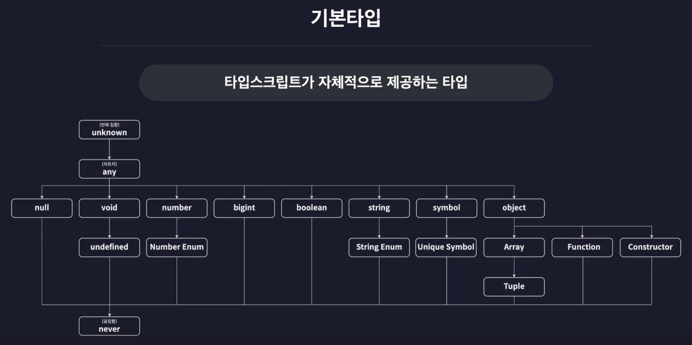

# TS 2강

Status: In progress
Due date: 06/11/2025
Task type: 👀 강의
세부사항: 기본타입, 원시타입과 리터럴 타입, 배열과 튜플
Updated at: 2025년 6월 11일 오전 9:40

## 상세설명

기본타입, 원시타입과 리터럴 타입, 배열과 튜플

## 세부적으로 할 일

- [x] 기본타입
- [x] 원시타입과 리터럴 타입
- [x] 배열과 튜플
- [x] review

## 참고자료

[https://www.inflearn.com/courses/lecture?courseId=330452&type=LECTURE&unitId=147956&subtitleLanguage=ko](https://www.inflearn.com/courses/lecture?courseId=330452&type=LECTURE&unitId=147956&subtitleLanguage=ko)

기본타입 ⇒

타입계층도



원시타입과 리터럴 타입 ⇒

원시타입(Primitive Type)

하나의 값만 저장하는 타입

number, string, boolean, null, undefined

```jsx
:number (주석 annotation) => 타입 주석

// number
let num1: number = 123; ✅
let numInfinity: Infinity; ✅
let numNaN: NaN; ✅
num.toFixed() ✅

num = "number"; ❌
num.toUpperCase(); ❌

// string
let str1: string = "string"; ✅
let str2: string = `string`; ✅
let str3: string = `hello ${num1}` ✅

str = 123;

str1.toFixed(); ❌
str1.toUpperCase(); ✅

// boolean
let bool1: boolean = true;
let bool2: boolean = false;

// null
let nulll: null = null; ✅

// undefined
let unde1: undefined = undefined; ✅

// JS에서는 댔지만 TS에서는 안 되는 행위
잠시동안 변수에 반 값을 넣어놓기 null

let numA: number = null; ❌ 'null 형식은 number 타입 안에 값을 정의할 수 없음'
tsconfig.json에서 옵션 추가해주면됨

strictNullChecks: false, =>
let numA: number = null; ✅ 'tsconfig 조정으로 허용'

개발 상황에 따라서 config 파일을 조정해서 쓸 수 있다.

strict: true; => on, of (좀 더 상위 개념)
```

리터럴타입

리터럴 > 값 (나중에 복합적인 요소를 넣을 때 유용하게 쓸 수 있음)

```jsx
// 리터럴 타입 (값 그차제가 타입이 되는 것
let numA: 10 = 10; ✅
numA = 12; ❌

let strA: "hello" = "hello"; ✅

let boolA: true = true; ✅
```

배열과 튜플

```jsx
// 배열
let numArr:number[] = [1, 2, 3]; ✅

let strArr:string[] = ["hello", "im", "dk"]; ✅

let boolArr:Array<boolean> = [true, false, true]; ✅
<boolean> => 제네릭문법

// 배열에 들어가는 요소들의 타입이 다양할 경우
let multiArr = [1, "hello"];
=>
let multiArr:(string | number)[]; ✅
( | )=> 유니온타입

// 다차원 배열의 타입을 정의하는 방법 => 대괄호를 여러 개 달아주기
let doubleArr:number[][] = [
 [1, 2, 3],
 [4, 5]
]

// 튜플 (JS에는 없고, TS에만 / 길이와 타입이 고정된 배열)
// 길이와 타입이 고정된 배열
let tup1:[number, number] = [1,2];
tup1 = [1, 2, 3]; ❌ 길이를 넘어섬
tup1 = ["1", "2"] ❌ 타입이 맞지 않음

let tup2: [number, string, boolean] = [1, "2", true]; ✅ 순서 바뀌면 안됨

tup1.push(1); ✅ 배열 메서드를 사용하면 인지를 하지 못함, 주의해서 사용
tup.pop(); ✅ 배열 메서드를 사용하면 인지를 하지 못함, 주의해서 사용

const users = [
	["김도경", 1],
	["김김김", 2],
	["이하나", 3],
	[5, "아무개"],
]; ✅ =>
런타임 과정에서 에러
5.toUpperCase(); ❌

컴파일러 과정에서 바로 에러
const users: [string, number][] = [
	["김도경", 1],
	["김김김", 2],
	["이하나", 3],
	[5, "아무개"], ❌
];
```
